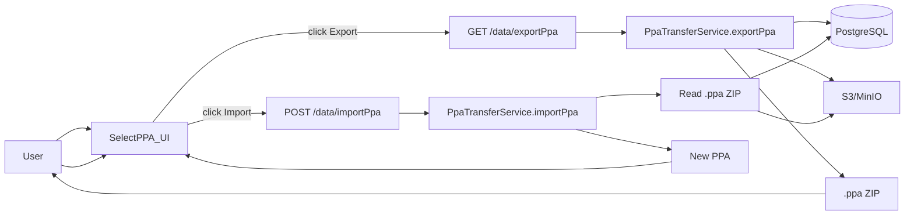

# PPA Export/Import Implementation Plan

## 1. Scope and behaviour

- **Export scope**
  - Export a **single PPA** selected by the user.
  - Include: PPA core fields, sectors, sector levels, mappings, metrics, subnational units + mappings, data source configuration, and associated uploaded **datasource files** (`UserFile`).
  - Exclude: user, account, invitations, roles, and **generated outputs** (charts/reports) for v1; outputs can be regenerated after import.
  - The export filename will be `{{ppaName}}_{{YYYY-MM-DD}}.ppa`.
- **Import behaviour**
  - Import always creates a **new PPA** under the **currently selected account** of the logged-in user.
  - All internal references (metrics → dataSources, mappings → dataSources, etc.) are preserved via an ID mapping built during import.
  - If there is no selected account / logged-in user, the backend returns a clear error.

## 2. Export format

- **Container**: a `.ppa` file, implemented as a ZIP archive with fixed structure:
  - `meta.json` – metadata:
    - `schemaVersion` (start at `1`), `exportedAt` (ISO8601), `appVersion` if easily accessible.
  - `ppa.json` – full PPA export DTO (see below).
  - `data/` – all binary datasource files used by this PPA (e.g. `data/1-population.csv`).
- **DTO structure** (new Java classes in e.g. `project/PPA/src/main/java/com/linksbridge/ppa/dto/`):
  - `PpaExportDto` – root DTO with:
    - Basic PPA fields (`name`, `aggregationLevel`, any other scalar config you need).
    - Collections: `List<DataSourceDto>`, `List<MetricDto>`, `List<PpaSectorDto>`, `List<PpaSectorLevelDto>`, `List<PpaSectorMappingDto>`, `List<SubnationalUnitDto>`, `List<SubnationalUnitMappingDto>`.
    - `List<UserFileDto>` – metadata for each datasource file included.
  - Each DTO keeps the **original DB ID** as `originalId` (or `id`) so references inside `ppa.json` can be resolved on import, but those IDs are never set as entity IDs when persisting.
  - `UserFileDto` includes: `originalId`, original file name, and a `fileRef` string pointing to the entry inside the ZIP (e.g. `data/1-population.csv`).
- **Serialization**
  - Use Jackson `ObjectMapper` (already available via Spring Boot) to `writeValue`/`readValue` `PpaExportDto` for `ppa.json`.

## 3. Backend: export service

- **New service**: e.g. `PpaTransferService` in `[project/PPA/src/main/java/com/linksbridge/ppa/service/PpaTransferService.java](project/PPA/src/main/java/com/linksbridge/ppa/service/PpaTransferService.java)`.
- **Dependencies**
  - Inject repositories for `Ppa`, `DataSource`, `UserFile`, `Metric`, `PpaSector`, `PpaSectorLevel`, `PpaSectorMapping`, `SubnationalUnit`, `SubnationalUnitMapping`.
  - Inject S3 client or `TransferManager` already used in `DataController` for datasource uploads (or reuse helper methods if they exist in a shared service).
- **Export algorithm**
  1. **Load PPA graph**
    - Given `ppaId` and current user/account (from `DataController` helper), load the `Ppa` and validate ownership.
    - Eagerly load related collections similar to how `duplicatePpas` works in `DataController` (reusing its repository patterns where possible).
  2. **Build DTO graph**
    - For each entity, create the corresponding DTO and set `originalId` plus all fields that are part of user configuration.
    - For reference fields, store only `originalId` references (e.g., `MetricDto.dataSourceId = dataSource.getId()`), not full nested objects.
  3. **Collect `UserFile`/datasource files**
    - For every `DataSource` in the PPA, follow the relation to its `UserFile` and add a `UserFileDto` if it has not yet been added.
    - Assign a deterministic `fileRef` for each file (e.g., `data/{counter}-{sanitizedOriginalName}`).
  4. **Build ZIP in-memory or streaming**
    - Create a `ByteArrayOutputStream` plus `ZipOutputStream`.
    - Write `meta.json` and `ppa.json` as UTF-8 text entries.
    - For each `UserFileDto`, fetch the underlying binary content:
      - Either use `AmazonS3.getObject(bucket, s3Key)` or, if the project already reads from the mounted filesystem location, open the file at `${s3.mount}/${s3.userfile.directory}/...`.
      - Stream contents into the ZIP under the corresponding `fileRef`.
  5. **Return**
    - Return the final `byte[]` or an `InputStreamResource` for the controller to send as the HTTP response.

## 4. Backend: import service

- **Extend `PpaTransferService**` with an `importPpa` method that takes `MultipartFile` or `InputStream`.
- **Import algorithm**
  1. **Open ZIP and parse JSON**
    - Use `ZipInputStream`/`ZipFile` to read and buffer `meta.json` and `ppa.json`.
    - Verify `schemaVersion == 1` (or handle a small range if desired). Abort with a clear error otherwise.
    - Deserialize `ppa.json` into `PpaExportDto`.
  2. **Prepare context**
    - Resolve the **current user and selected account** using existing helpers in `DataController` (or the same service they use).
    - Initialize maps `oldDataSourceId → newDataSource`, `oldUserFileId → newUserFile`, `oldSectorId → newSector`, etc. as `HashMap<Long, Entity>`.
  3. **Recreate `UserFile` + upload data**
    - For each `UserFileDto` in DTO:
      - Locate its binary entry in the ZIP via `fileRef` and obtain an `InputStream`.
      - Reuse or extract the logic from `DataController.loadUserFile` that:
        - Constructs a new unique S3 key under `s3.userfile.directory`,
        - Uploads the stream to S3 (or MinIO) using the existing `TransferManager`/`AmazonS3`,
        - Creates a new `UserFile` entity linked to the current account.
      - Store the new `UserFile` in `oldUserFileId → newUserFile` map.
  4. **Create new PPA entity**
    - Create a new `Ppa` with `id == null` and copy relevant scalar fields from the DTO.
    - Attach to the current account and persist it early so children can reference it.
  5. **Recreate children in a safe order**
    - **DataSources**: for each `DataSourceDto`:
      - Create a new `DataSource`, set scalar config fields, link it to the new `Ppa` and the mapped `UserFile` from `oldUserFileId → newUserFile`.
      - Save and populate `oldDataSourceId → newDataSource`.
    - **Metrics**: create `Metric` entities using the new `Ppa` and mapped `DataSource` and any `MetricType` IDs (assume `MetricType` reference data already exists in the target environment).
    - **PpaSector** and **PpaSectorLevel**: recreate these referencing the new PPA.
      - Map old sector IDs to new ones so that mappings can be rebuilt.
    - **PpaSectorMapping**: recreate each mapping, replacing references to old `PpaSectorLevel` and old `DataSource` with new ones using the maps.
    - **SubnationalUnit** and **SubnationalUnitMapping**: similarly recreate units and then mappings using `oldSubnationalUnitId → newSubnationalUnit` and `oldDataSourceId → newDataSource` maps.
  6. **Finalize**
    - Ensure everything is persisted within a single transactional boundary to avoid partially imported graphs.
    - Return the new PPA ID (and optionally its name) to the controller.

## 5. Backend: controller endpoints

- **File:** `[project/PPA/src/main/java/com/linksbridge/ppa/controller/DataController.java](project/PPA/src/main/java/com/linksbridge/ppa/controller/DataController.java)`
- **New endpoints**
  - `@GetMapping("/data/exportPpa")`
    - Params: `Long ppaId`.
    - Uses existing current user/account resolution.
    - Delegates to `ppaTransferService.exportPpa(ppaId, currentAccount)` and returns a `ResponseEntity<byte[]>`.
    - Sets `Content-Type: application/octet-stream` and `Content-Disposition` with filename `${sanitizedPpaName}_${yyyy-MM-dd}.ppa`.
  - `@PostMapping("/data/importPpa")`
    - Consumes `multipart/form-data` with one file param (e.g. `@RequestParam("file") MultipartFile file`).
    - Resolves current user + selected account; if none, returns an error.
    - Delegates to `ppaTransferService.importPpa(file.getInputStream(), currentAccount, currentUser)`.
    - Returns a small DTO, e.g. `{ "ppaId": <newId>, "name": "..." }`, for the frontend to navigate to the imported PPA.
- **Security & validation**
  - Ensure endpoints require `ROLE_USER` the same way as other PPA endpoints.
  - Validate that the requested `ppaId` in export belongs to the current account.

## 6. Frontend: PPA list UI (SelectPPA)

- **Files**
  - Template: `[project/PPA/src/main/resources/templates/fragments/SelectPPA.html](project/PPA/src/main/resources/templates/fragments/SelectPPA.html)`
  - Controller script: `[project/PPA/src/main/resources/static/js/SelectPPA.js](project/PPA/src/main/resources/static/js/SelectPPA.js)`
- **Toolbar: add Import button**
  - Extend the `toolbar` array in `SelectPPA.js` datagrid setup to include a second button, e.g.:
    - `id: "SelectPPA-ppas-importButton", iconCls: "icon-import", text: getMessage("SelectPPA.ppas.import"), handler: $scope.openImportDialog`.
  - In `onLoadSuccess`, no extra wiring is needed for this toolbar button besides linking to the scope handler.
- **Per-row Export button**
  - Add an `export` column next to `duplicate`/`delete` in the `columns` config, with a formatter that renders an `` when `$scope.editable`.
  - In `onLoadSuccess`, mirror the pattern used for duplicate/delete:
    - Attach an EasyUI `linkbutton` with `iconCls: "icon-export"` and an `onClick` that calls `$scope.exportPpa(ppaId)`.
  - Implement `$scope.exportPpa = function(ppaId) { if (ppaId) { window.location = "data/exportPpa?ppaId=" + ppaId; } }` to trigger the file download.
- **Import file flow**
  - Add a small hidden form to `SelectPPA.html`, similar to `SelectOutputTypeAndGo1-getOutput` but for upload:
    - `<form id='SelectPPA-importForm' method='post' enctype='multipart/form-data' action='data/importPpa'>` with `<input type='file' id='SelectPPA-importFile' name='file' style='display:none;'>`.
  - In `SelectPPA.js`:
    - Implement `$scope.openImportDialog` to trigger `$("#SelectPPA-importFile").click();`.
    - Add a `change` handler for `#SelectPPA-importFile` that builds a `FormData` and posts it via `$.ajax` (or the same helper pattern used by the existing data-upload UI), then on success:
      - Call `$scope.refreshPpas()`.
      - Optionally call `call(null, "selectPpa", [response.ppaId])` to auto-select the newly imported PPA.
- **Top-right menu integration**
  - In the main header markup and `createMenu` in `[project/PPA/src/main/resources/static/js/index.js](project/PPA/src/main/resources/static/js/index.js)`, add a new menu item **“Import/Export”**.
    - Clicking this item simply calls `$scope.selectContentTab("SelectPPA")` so users jump to the PPA start page where the import/export buttons live.

## 7. Desktop compatibility

- **Reuse existing S3/MinIO configuration**
  - Use the existing `s3.bucket`/`s3.mount` and the same S3 client/TransferManager as in `loadUserFile`.
  - For **export**, read datasource files from the same location S3/MinIO uses (either directly from S3 or from the mounted filesystem under `${s3.mount}/${s3.userfile.directory}`).
  - For **import**, always go through the same upload path as regular datasource uploads, so bucket/paths remain consistent within the PPA Desktop environment.
- **No extra profiles required**
  - Keep all new logic behind the existing configuration; avoid introducing additional profiles or properties files.
  - Make sure any temporary file usage for ZIP processing uses safe temp directories (e.g. `Files.createTempDirectory`) within the container or host where PPA Desktop runs.

## 8. Testing and validation

- **Unit/integration tests (backend)**
  - Add tests around `PpaTransferService` to:
    - Export a small PPA with one datasource, sector, mapping, and metric, then import and assert that:
      - A new PPA is created under the same account.
      - All necessary entities exist and reference each other correctly.
    - Validate that exporting a PPA from one account cannot be done by a user of another account.
- **Manual tests (desktop)**
  - On a local PPA Desktop setup, create a PPA with some uploaded data, export it, then import it into another (fresh) PPA Desktop instance and check that the wizard steps and outputs regenerate correctly.

## 9. High-level flow diagram

